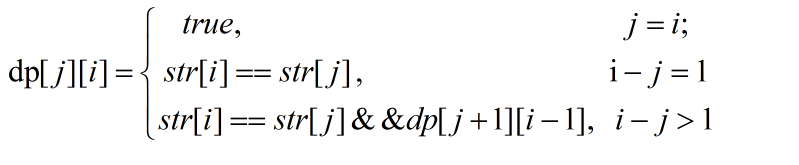

# problem
>回文串就是正着读和反着读一样的字符串，如“abba”，"abcba"，最长回文子串是字符串的子串中最长的属于回文串的子串。如字符串"abbaabccba"的最长回文子串为"abccba".


# codes
```
#include<iostream>
#include<string>
using namespace std;

string longestPalindrome(string s){
    int n=s.size();
    bool dp[n][n];
    fill_n(&dp[0][0],n*n, false);
    int max_len=1;
    int start=0;
    for(int i=0;i<n;i++){
        for(int j=0;j<=i;j++){
            if(i-j<=2){
                dp[j][i]=(s[i]==s[j]);
            }else{
                dp[j][i]=(s[i]==s[j]&&dp[j+1][i-1]);
            }
            if(dp[j][i]&&max_len<(i-j+1)){
                max_len=i-j+1;
                start=j;
            }
        }
    }
    return s.substr(start,max_len);
    
}

int main(){
//    printf("hello world");
    string s;
    s=longestPalindrome("abbaabccba");
    cout<<s<<endl;
    return 0;
}

```

## 为什么别人的正确，我的AC不了，下面是别人的
```
class Solution {
public:
    // 最长回文串，使用dp
    string longestPalindrome(string str)
    {
     int n = str.length();
    if(n==0) return "";
    bool dp[n][n];
    fill_n(&dp[0][0],n*n,false);
    int left=0,right=0,maxLen = 0;
    for(int j=0;j<n;j++)
    {
      dp[j][j] = true;
      for(int i=0;i<j;i++)
      {
          dp[i][j] = (str[i] == str[j] && (j-i < 2 || dp[i+1][j-1]));
          if(dp[i][j] && (j-i+1 > maxLen))
          {
              left = i;
              right = j;
              maxLen = j-i+1;
          }
      }
    }
    return str.substr(left,right-left+1);
    }
};
```

# analysis
>本文采用动态规划算法来查找最长回文子串，算法时间复杂度为O（n²）。设状态dp[j][i]表示索引j到索引i的子串是否是回文串。则dp[j][i]为true时表示索引j到索引i形成的子串为回文子串，且子串起点索引为i,长度为i-j+1。
判断索引j到索引i是否是回文子串，要判断当前的两个字符是否相同，即s[i]=s[j]，还要判断j+1，i-1是否是回文子串。满足这两者条件才行。
 

# reference 
[动态规划算法求最长回文子串][1]
[[编程题]longest-palindromic-substring][2]

[1]: https://blog.csdn.net/shineboyxxb/article/details/52079360
[2]: https://www.nowcoder.com/questionTerminal/c15cd9e18e4845758d4c1086963731e2