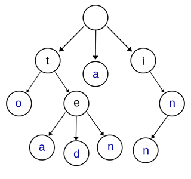

# problem
>Implement a trie with insert, search, and startsWith methods.

Note:
You may assume that all inputs are consist of lowercase letters a-z.


# codes

##  problem one ac不了
```

class TrieNode{
  public:
    unordered_map<char,TrieNode *> children; 
    bool isLeaf;
    TrieNode(){isLeaf = false;};
};

class Trie {
private:
    TrieNode* root;
public:
    /** Initialize your data structure here. */
    Trie() {
        root = new TrieNode();
    }
    
    /** Inserts a word into the trie. */
    void insert(string word) {
        TrieNode *cur = root;
        for(int i=0;i<word.size();i++){
            if(cur->children.find(word[i])==cur->children.end()){
                cur->children[word[i]] = new TrieNode();
            }
            cur=cur->children[word[i]];
        }
        cur->isLeaf=true;
    }
    
    /** Returns if the word is in the trie. */
    bool search(string word) {
        TrieNode *cur = root;
        for(int i=0;i<word.size();i++){
            if(cur->children.find(word[i])==cur->children.end()){
                return false;
            }
            cur=cur->children[word[i]];
        }
        if(cur->isLeaf){
            return true;
        }
        return false;
    }
    
    /** Returns if there is any word in the trie that starts with the given prefix. */
    bool startsWith(string prefix) {
        TrieNode *cur = root;
        for(int i=0;i<prefix.size();i++){
            if(cur->children.find(prefix[i])==cur->children.end()){
                return false;
            }
            cur=cur->children[prefix[i]];
        }
        return true;
    }
};


/**
 * Your Trie object will be instantiated and called as such:
 * Trie obj = new Trie();
 * obj.insert(word);
 * bool param_2 = obj.search(word);
 * bool param_3 = obj.startsWith(prefix);
 */

```

# analysis
> 字典树，我本人不是很懂这个树结构，然后百度了一下是这样解释的。
Trie树，又叫字典树、前缀树（Prefix Tree）、单词查找树或键树，是一种多叉树结构。

上图是一棵Trie树，表示了关键字集合{“a”, “to”, “tea”, “ted”, “ten”, “i”, “in”, “inn”} 。从上图可以归纳出Trie树的基本性质： 
①根节点不包含字符，除根节点外的每一个子节点都包含一个字符。 
②从根节点到某一个节点，路径上经过的字符连接起来，为该节点对应的字符串。 
③每个节点的所有子节点包含的字符互不相同。 
④从第一字符开始有连续重复的字符只占用一个节点，比如上面的to，和ten，中重复的单词t只占用了一个节点。
# reference
[leetcode 208 Implement Trie C++][1]
[前缀树（Trie）原理及Java实现][2]

[1]: https://blog.csdn.net/a2331046/article/details/70149908
[2]: https://blog.csdn.net/u013309870/article/details/71081393