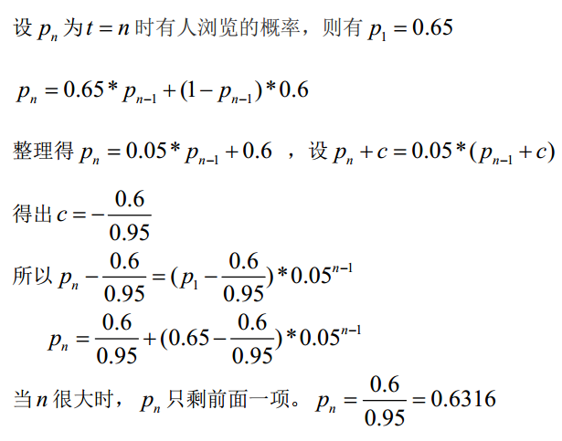
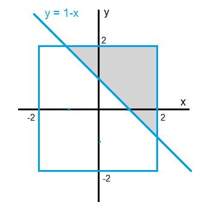
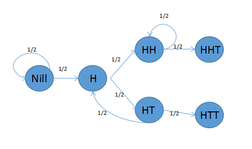
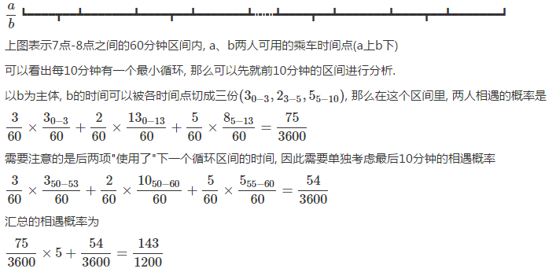

# problem
## problem one
- 关系运算包括选择、投影、连接以及除法。
- 集合运算是二目运算，包括并、差、交、广义笛卡尔积四种运算。

## problem two
```
某团队有 2/5 的人会写 Java 程序，有 3/4 的人会写 C++程序，这个团队里同时会写 Java 和 C++的最少有______人。
```
- 概率论公式 P(A∪B)=P(A)+P(B)-P(A∩B)  
- 4*5最小公倍数20人,20*(2/5+3/4-1) = 3

## problem three
```
平面内有11个点，由它们连成48条不同的直线，由这些点可连成多少个三角形？
```
- 平面内有11个点，如果没有多个点在一条线上，最多可以有C11 2=11*10/2=55
- 而目前只连成48条直线，说明有多个点在一条线上。55-48=7条
- 而三个点在一条直线上，减少C3 2 - 1 = 2条线
- 四个点在一条线上，减少C4 2 - 1 = 5条
- 五个点在一条线上，减少C5 2 - 1 = 9条
- 所以所以有一组三个点共线有一组四个点共线
- 如果没有3个或3个以上的点在一条直线上，则可以连上C(11,3)=165
- 现在有一个三点共线和一个四点共线，三点共线会减少1个三角形,C(3,3)=1
- 四点共线会减少4个三角形，C(4,3)=4
- 则最终的连接个数为165-1-4-160

## problem four
```
How many rectangles you can find from 3*4 grid?
```
- 因为每两条横线与两条竖线可以组成一个矩形，
- 共有4条横线，5条竖线
- 因此共有C(4,2)*C(5,2)=6*10=60个

## problem five
```
老王去年种了一块菜地，今年他又新开发出了一块比去年大的正方形菜地，这块新地的卷心菜的产量比去年多211只。请问他今年总共可从这两块菜地上收获多少只卷心菜?(假设面积相等的菜地去年和今年的产量一样)。
```
- 总共收获2x+211颗，其中x必须为整数。

## problem six
```
杀人游戏，6个人互相投票，有一个人被其他5个人一起投死的概率是多少（）？
假设每个人都不会投自己，投其他每个人是等概率的。
```
- （6*5）/（5^6）
- 分母：每个人都有5种选择，即总的投票情况有5^6种
- 分子：被投死的人可以是6人中任一个，被投死的人有5种投票的情况

## problem seven
```
我们在将某个订单送给某一司机之前，需要计算一下这个司机选择接受这个订单的概率，现有A,B两个订单，对某一司机。已知：
1.如果只将订单A播送给司机，司机接受的概率是Pa;
2.如果只将订单B播送给司机，司机接受的概率是Pb;
现在讲A，B同时播送给该司机，司机选择A的概率是多少

```
- 则 P(A) = Pa(1-Pb)，P(B)=Pb(1-Pa)，P(AB)=PaPb，P(不接)=(1-Pa)(1-Pb)
- 若两单只能接一单或不接，即去掉AB。那么概率为P(A)/(1-P(AB)) = Pa(1-Pb)/(1-PaPb)，选C

## problem eight
```
假设淘宝网上某商品A在任一时刻t内若有人浏览，则该商品在下一时刻t+1内无人浏览的概率为0.35（即下一时刻的浏览情况仅与当前时段相关），定义此条件概率为 P(O_{t+1}=0|O_t=1)=0.35(即用“1”代表有人浏览的事件，用“0”代表无人浏览的事件），类似得定义P(O_{t+1}=1|O_t=1)=0.65，P(O_{t+1}=0|O_t=0)=0.4，P(O_{t+1}=1|O_t=0)=0.6。若此商品A在t=0时有人浏览，它在t=100000时有人浏览的概率是____。
```


## problem nine
```
人工批量种植盆景虎皮兰，已知它们植株高度平均70cm，标准差5cm。现在从中随机输出100盆景到市场销售，则下面说法错误的是（）：
估计100盆中至少有75盆高度在60到80cm之间
有较高把握估测这100盆的平均高度在69到72cm之间
估计100盘中至少有70盆高度在65到75cm之间
```
- 正态分布曲线性质中有 ：P（μ-σ<X≤μ+σ）=68.3%P（μ-2σ<X≤μ+2σ）=95.4%P（μ-3σ<X≤μ+3σ）=99.7%；依照题意，落在 [65,75]之间 平均有 有68盆，落在[60,80]之间 平均 有95盆

## problem ten
```
集合A={0，1，2} 上的四个关系中，哪个是等价关系？ （ ）
R1={<0,0>, <1,1>, <2,2>, <1,2> }
R2={<0,0>, <1,1>, <2,2>, <0,1>,<1,0>}
R3={<0,0>, <1,1>, <2,2>, <0,2>, <2,1> }
R4={<0,1>, <1,0>, <0,0>, <1,1>}
```
- 等价关系需要满足三个性质：自反性、对称性、传递性。R1不满足对称性，R3不满足对称性、传递性，R4不满足自反性。

> 强度 λ 的泊松过程的点间间距是相互独立的随机变量，且服从同一个指数分布（即参数为 λ  的指数分布），而指数分布的均值为1/λ 。

## problem eleven
```
H同学每天乘公交上学，早上睡过头或遇到堵车都会迟到；H早上睡过头的概率为0.2，路上遇到堵车的概率为0.5；若某天早上H迟到了，那么以下推测正确的有（）。
```
- 因为H同学迟到是事实，所以睡过头占迟到总概率为2/7,堵车占迟到总概率为5/7

## problem twelve
```
有8只球队，采用抽签的方式随机配对，组成4场比赛。假设其中有4只强队，那么出现强强对话（任意两只强队相遇）的概率是____。
```
- 把8支队伍分成强队（A、B、C、D）和弱队（A‘、B’、C‘、D’），首先考虑全组合：A可以选择剩下的7支队伍，剩下6支队伍假设为（B、C、D）和弱队（B’、C‘、D’），B选择可以选5支队伍，然后剩下的可以选3支，剩下两队就不用选了，总共为7*5*3；如果只能强队和弱队组合：A可以选4支队伍，然后B可以选3支，然后C可以选2支，D也不用选了，总共为4*3*2。出现强强相遇的概率就为
1-(4*3*2)/(7*5*3)=27/35

### reference
[[阿里笔试]有8只球队,采用抽签的方式随机配对,组成4场比赛。假设其中有4只强队,那么出现强强对话 (任意两只强队相遇)的概率是？][1]
[球队强强对话的概率。][2]

[1]: https://blog.csdn.net/mrchen11/article/details/47073565
[2]: https://www.nowcoder.com/questionTerminal/ff577cb8047b44a587356fa51d584fd5

## problem thirteen
```
在区间[-2, 2]里任取两个实数，它们的和>1的概率是()
```


转换成坐标系就是一个线性规划的题目，x+y>1 占上述举行的面积比

## problem fourteen
```
推理：24个人，每人至少养一种宠物，养鸟、狗、鱼、猫的分别为13、5、10、9人，同时养鸟和狗的2人，同时养鸟和鱼、鸟和猫、鱼和猫的各为4人，养狗的既不养猫也不养鱼。问只养一种宠物的总共几人？同时养鸟鱼猫的几人？
```
- 并集AuBuCuD=24. A:鸟 B:狗 C:鱼 D:猫
- A=13，B=5，C=10，D=9.
- 交集AnB=2，AnC=4，AnD=4，CnD=4.
- 还有一个交集AnCnD。没有其他可能的集合。
- A+B+C+D-(AnB+AnC+AnD+CnD)+AnCnD=AuBuCuD。
- 可得AnCnD=24-（37-14）=1.
- 13-2-4-4+1=4.  5-2=3.  10-4-4+1=3. 9-4-4+1=2
- 4+3+3+2=12

## problem fifteen
```
集合A到B共有64个不同的函数，则B中元素不可能有（  ）个。
4
8
16
64
```

- 集合 A元素为a个，集合B元素为b个，则集合a到b的函数共有b^a个。

## problem sixteen
```
有20个自然数1-20.每次取两个数字,取出不放回，其中一个数字是另一个数字2倍多。则最多取出来（）个数字。
```
- 因为1到9的2倍多不会超过20,所以1到9我们放在第一个取的举个例子
 1  10
 2  11
 3  12
 4  13
 5  14
 6  15
 7  16
 8   17
 9   19
共18个

## problem seventeen
```
用两种颜色去染排成一个圈的6个棋子，如果通过旋转得到则只算一种，问一共有多少____种染色模式。
```
- polya定理：
(2^6+2^1+2^2+2^3+2^2+2^1)/6=14
- 假如两个颜色分别为黑白，全黑：1，一个白：1，两个白:3，三个白：4，根据对称性，四个白为3，五个白为1，全白为1，则有14种

## problem eighteen
```
马路上有编号1,2,3...10的十盏路灯，为节约用电而又不影响照明，可以把其中3盏灯关掉，但不可以同时关掉相邻的两盏，在两端的灯都不能关掉的情况下，有()种不同的关灯方法。
```
- 采用插隔板法，即8灯关3,余5灯亮,5灯之间6个空,插入3盏不亮灯即C（6,3）

## problem nineteen
```
某次买可乐集瓶盖活动中有5种不同的瓶盖以等概率出现，每买一瓶汽水可得到一个瓶盖，集齐所有瓶盖所买汽水瓶数的期望，与以下哪个结果最为接近
```
- 取到一种不同瓶盖的期望次数为1； 在已经取到一种瓶盖的情况下，再取到一种不同的瓶盖的期望次数是1/（4/5）=5/4； 在已经取到两种瓶盖的情况下，再取到一种不同的瓶盖的期望次数是1/（3/5）=5/3； 因此，取到五种瓶盖的期望次数为1+5/4+5/3+5/2+5/1=11+5/12。

## problem twenty
```
三个骰子摇到的点数之和为（）的概率最大？
```
- 点数和为10时，可以分为：（1）（1，3，6），（1，4，5），（2，3，5）；（2）（2，2，6），（3，3，4），（4，4，2）。

P = (3! * 3 + 3 * 3)/6*6*6 = 27/216
- 点数和为11时，也分为两种情况：（1）（1，4，6），（2，3，6），（2，4，5）； （2）（3，3，5），（4，4，3），（5，5，1）

P = (3! * 3 + 3 * 3)/6*6*6 = 27/216

### reference
[ 三个骰子点数之和概率][3]

[3]: https://blog.csdn.net/moses1213/article/details/52558256

## problem twenty one
```
小a和小b一起玩一个游戏，两个人一起抛掷一枚硬币，正面为H，反面为T。两个人把抛到的结果写成一个序列。如果出现HHT则小a获胜，游戏结束。如果HTT出现则小b获胜。小a想问一下他获胜的概率是多少？
```
- 随机过程中的First Step Analysis
设P_s表示状态为s时'HHT'发生的概率。显然我们有P(HHT)=1以及P(HTT)=0。

Nill表示还没有抛时的状态，这时有1/2的概率变成H还有1/2的概率变成T，变成T时相当于又回到Nill。
我们要求的即P(Nill)。
由状态转移图，可以列出式子:
P(Nill) = 1/2*P(Nill) + 1/2*P(H)
P(H) = 1/2*P(HH) + 1/2 * P(HT)
P(HH) = 1/2*P(HH) + 1/2*P(HHT)
P(HT) = 1/2*P(H) + 1/2*P(HTT)
p(HHT) = 1
P(HTT) = 0
最后可以解得 P(Nill) = 2/3

## problem twenty two
```
含5个节点，3条边的不同构的简单图有（  ）
```
- 
1.  A--B,A--C,A---D,E
2.  A--B,A--C,C--D,E
3. A--B--C--D,E
3. A--B--C,D--E

## problem twenty three
```
硬币游戏：连续扔硬币，直到 某一人获胜，A获胜条件是先正后反，B获胜是出现连续两次反面，问AB游戏时A获胜概率是？
```
- 考虑先抛两次，共4种情况：正正，正反，反正，反反；
正反 A胜，反反 B胜；
正正 情况下，接着抛，如果是正，游戏继续；如果是反，A胜。所以这种情况下最终也是A胜。
反正 情况下也是类似的，最终也是A胜。
所以A得胜率是3/4.

## problem twenty four
```
两个人抛硬币，规定第一个抛出正面的人可以吃到苹果，请问先抛的人能吃到苹果的概率多大？
```
- 先抛的人能吃到苹果的概率：
第一次吃到苹果P1：1/2;正
第二次吃到苹果P2：1/2 * 1/2 * 1/2;(反反正)
第三次吃到苹果P3：1/2 * 1/2 * 1/2 * 1/2 * 1/2;(反反反反正)
第四次吃到苹果P4： 1/2 * 1/2 * 1/2 * 1/2 * 1/2 * 1/2 * 1/2 ;(反反反反反反正)
...
第 N 次吃到苹果Pn： 1/2 * 1/2 * 1/2 * ... * 1/2 * 1/2 * 1/2 ;
先抛的人能吃到苹果的概率：P = P1+P2+...+Pn = 1/2 + 1/2 * （1/4） + 1/2 * (1/4)^2 + ... + 1/2 * (1/4)^(n-1)
= 1/2 * （1 + （1/4）^1 + （1/4）^2 + （1/4）^3 + （1/4）^(n-1) ）
<= 1/2 * （1 + 1/4 / (1-1/4)）(n->无穷大)
<= 1/2 * 4/3 = 2/3

## problem twenty five
```
有甲乙两只圆柱形玻璃杯，其内径一次是 10 厘米、 20 厘米，杯中都装满了水。甲杯中之前放有一铁块，当取出此铁块时，甲杯中的水位下降了 2 厘米，然后将此铁块放入乙杯中。问：这时乙杯中的水位上升了多少厘米？
```
- 这道题有些像脑筋急转弯，其实想明白了也非常简单。注意“杯中都装满了水”这句话，表明乙杯在放入铁块之前便已装满水，现在放入一个铁块只能使水漫出来，但水面不会增高。


## problem twenty six
```
若AB为任意两个随机事件，则（）
P(AB)<=(P(A)+P(B))/2
```
- 由P（AB）定义可知：P（AB）<=P(A)，P（AB）<=P(B)；相加，除以2
- 如果A包含B，则P(AB)=P(B)，而P(A)*P(B)<=1*P(B)=P(B)，即P(AB)可能大于P(A)*P(B)

## problem twenty seven
```
其他每天有流量雨的概率是相等的，一个人每天晚上都去观察，发现一个月能够看到流星的概率是91%，请问半个月中能够看到流量的概率是多少？
```
- 设一天中看得到流星雨的概率为X
一个月至少能看到一场的概率为：1-（1-X）30=91%
那么（1-X）15 =30%
则半个月至少能看到一场流行雨的概率为：1-（1-X）15=70%

## problem twenty eight
```
一个英雄基础攻击力为100，携带了三件暴击武器，武器A有40%的概率打出2倍攻击，武器B有20%的概率打出4倍攻击，武器C有10%概率打出6倍攻击，各暴击效果触发是独立事件，但是多个暴击效果在一次攻击中同时触发时只有后面武器的暴击真正生效，例如一次攻击中武器A判定不暴击，武器B和武器C都判定触发暴击，那么这次攻击实际是600攻击力。那么这个英雄攻击力的数学期望是____。
```
- 600 * 10%） // 使用武器C
+（400* 90% * 20% ） // 使用武器B，需要保证没有使用武器C，否则因为多个暴击效果在一次攻击中同时触发时只有后面武器的暴击真正生效，武器B不生效
+（200 * 90% * 80% * 40%）  // 同理，使用武器A，需要保证武器B和C都没有使用
+（100*60%*80%*90%）// 没有使用任何武器
= 232.8

## problem twenty nine
```
有两个袋子，白色袋子里有7个红球和3个蓝球，黑色袋子里有3个红球和7个蓝球。每次取一个球，取完立刻放回，所有球都从某一个袋子里取，袋子的选择是随机的。共取出6个红球和4个蓝球。问所有球是从黑色袋子里取出的概率是（）
```
- 0.3^6 * 0.7^4  / ( 0.7^6 * 0.3^4 + 0.3^6 * 0.7^4)   ;//分子分母同时除以 0.3^4 * 0.7^4
- 0.3^2 * / ( 0.7^2+ 0.3^2) = 9/(49+9) =     0.16

## problem thirty
```
在一冒险游戏里，你见到一个宝箱，身上有N把钥匙，其中一把可以打开宝箱，假如没有任何提示，随机尝试，问：
（1）恰好第K次（1=<K<=N）打开宝箱的概率是多少。
（2）平均需要尝试多少次
```
- （1）恰好第K次（1=<K<=N）打开宝箱的概率是多少。 
    (1-1/n)*(1-1/(n-1))*(1-1/(n-2))***(1/(n-k+1)) = 1/n
- （2）平均需要尝试多少次。
这个就是求期望值   由于每次打开宝箱的概率都是1/n，则期望值为：   1*(1/n)+2*(1/n)+3*(1/n)+......+n*(1/n) = （n+1）/2

## problem thirty one
```
有个苦逼的上班族，他每天忘记定闹钟的概率为0.2，上班堵车的概率为0.5，如果他既没定闹钟上班又堵车那他迟到的概率为1.0，如果他定了闹钟但是上班堵车那他迟到的概率为0.8，如果他没定闹钟但是上班不堵车他迟到的概率为0.9，如果他既定了闹钟上班又不堵车那他迟到的概率为0.0，那么求出他在60天里上班迟到的期望。
```
-  每天迟到的概率P=1*0.2*0.5+0.9*0.2*0.5+0.8*0.8*0.5+0=0.51
E（x1+x2+...+x60）=E(x1)+...+E(x60)=60*0.51=30.6

## problem thrity two
```
有三个黑气球，其中只有一个黑气球中有金币，你可以任意选择任何一个气球，而主持人在剩下的气球中打破一个气球，然后告诉你里边没有金币:你还有一次机会，既可以坚持选择，也可以换另外一个未打破的气球。如果你选择换的话获得金币的概率为()
```
-  如果你第一次选择有金币的气球（1/3的概率），那么你换了之后肯定得不到金币，所以这种情况下得到金币的概率是1/3*0=0。如果你第一次选择没有金币的气球（2/3的概率），那么你换了之后，剩下的那个没有破的气球里面就是金币，所以这种情况下得到金币的概率是2/3*1=2/3。总概率0+2/3=2/3。 

### learning

t检验，主要运用于样本含量较少（一般n<30），总体标准差σ未知的正态分布资料。
适用条件：
(1) 已知一个总体均数；
(2) 可得到一个样本均数及该样本标准差；
(3) 样本来自正态或近似正态总体。
U检验应用条件和t检验应用条件基本一致， 只是大样本时用u检验 ，小样本时用t检验，t检验可以代替U检验。

## problem thirty three
```
平均要取多少个(0,1)中的随机数才能让和超过1。
```
- 任取n个0到1之间的实数，这些数之和小于1的概率：
(1) n=1，p1 = 1 = 1/1!

(2) n=2，p2 = 1/2 = 1/2!

二维空间中x+y<1的几何分布模型

(3) n=3，p3 = 1/6 = 1/3!

三维空间中x+y+z<1在单位立方体中截得三棱锥的体积

∫(0..1) (x^2)*1/2 dx = 1/6

(4) n=4，p4 = 1/24 = 1/4!

四维空间中单位立方体一角的“体积”，其“底面”为一个体积为1/6的三维体

 ∫(0..1) (x^3)*1/6 dx = 1/24

    依此类推， n 个随机数之和不超过 1 的概率就是 1/n! ，反过来 n 个数之和大于 1 的概率就是 1 - 1/n! ，因此加到第 n 个数才刚好超过 1 的概率就是

       (1 - 1/n!) - (1 - 1/(n-1)!) = (n-1)/n!

    因此，要想让和超过 1 ，需要累加的期望次数为

       ∑(n=2..∞) n * (n-1)/n! = ∑(n=1..∞) n/n! = e


## problem thirty four
```
a和b两个人每天都会在7点-8点之间到同一个车站乘坐公交车，a坐101路公交车，每5分钟一班【7:00,7:05……】，b坐102路公交车，每10分钟一班【7:03,7:13…】，问a和b碰面的概率是多少？（ ）
```

以b作为对象：对于每个10分钟来说,相遇概率计算：3/60*3/60表明在b在0~3分钟来此时a只能在0~3分钟来，2/60表明b在3~5分钟来此时a可以在0~13分钟来肯定相遇，5/60表明b在5~10分钟来此时a可以在5~13分钟来都没有问题。

## problem thrity five
```
假设淘宝用户上的用户看到一个商品后购买的概率是5%，收藏的概率是20%，而用户收藏一个商品之后购买的概率是20%，那么已知某用户看到某商品之后完成了购买，那么该用户收藏过该商品的概率是____。
```
- 设A为买，B为收藏。 已知P(A)=5%, P(B)=20%, P(A|B) = 20%。
所以P（B|A）=P(AB)/P(A) = P(A|B)P(B)/P(A) = 80%.

## problem thirty six
```
四维空间中有两个夹角60度的向量A和B，随机生成一个向量C分别与A和B计算内积，那么两个内积符号相同的概率为____。
```
- 内积 A · B=|A| · |B| · cos<A,B> ， 内积的正负由A,B夹角余弦决定，夹角的取值范围为[0， Π]

设 A 向量方向为 X 轴正方向，B向量为60度(当然也可能为120度，只考虑第1和第2象限，其他象限概率相同，特值为60度是合理的)
则 C 与 A的夹角为 [ 0, Π /2 ]为正 ，[ Π /2， Π ]为负； 则 C 与 B的夹角为 [  Π /3 , Π /2+ Π /3 ]为正 ，[ Π /2+ Π /3 ， Π ]为负
因此:    2 Π / 3  /    Π   =2/3

## problem thirty seven
```
52张牌，没有大小王，平均分给4个人，至少一个人拿到至少2张A的概率是多少？
```
- 52张牌分给四个人，则每人13张，全排列是52！
至少一个人拿到至少2张A的反面情况即为：4个人每个人拿一张A
这种情况为：每13张牌中有一个是A，四个A的全排列为4！，则此种情况一共为：
4! * C(13,1) * C(13,1) * C(13,1) * C(13,1)乘以剩下的48张牌的全排48！
所以答案应该为：1- 4! * C(13,1) * C(13,1) * C(13,1) * C(13,1)*48！/52!  约等于 0.895

### learning
- 随机变量的分布密度积分为1
- 假设检验的基本思想是小概率 反证法 思想。小概率思想是指小概率事件(P<0.01或P<0.05)在一次试验中基本上不会发生。 反证法 思想是先提出假设(检验假设H0)，再用适当的统计方法确定假设成立的可能性大小，如可能性小，则认为假设不成立，若可能性大，则还不能认为不假设成立。

## problem thirty eight
```
设事件A,B 相互独立，且已知P(A)=0.6, P(A U B)=0.7, 则P(B)= （ ）
```
- P(A U B)=0.7 = P(A) + P(B) - P(AB),由于A和B相互独立，则P(AB) = P(A)*P(B)，且P(A)=0.6，可得P(B) = 1/4

## problem thirty nine
```
每台物理计算机可以虚拟出 20 台虚拟机，假设一台虚拟机发生故障当且仅当它所宿主的物理机发生故障。通过 5 台物理机虚拟出100 台虚拟机，那么关于这 100 台虚拟机的故障的说法正确的是（）？
A 单台虚拟机的故障率高于单台物理机的故障率
B 这 100 台虚拟机发生故障是彼此独立的
C 这100台虚拟机单位时间内出现故障的个数高于100台物理机单位时 间内出现故障的个数
D 无法判断这 100 台虚拟机和 100 台物理机哪个更可靠
E 如果随机选出 5 台虚拟机组成集群， 那么这个集群的可靠性和 5 台物 理机的可靠性相同
F 可能有一段时间只有一台虚拟机发生故障
```
- 对于D选项：100台虚拟机，也就是只有5台物理机。
假设物理机的故障率为a，那么5台物理机的可靠率为1-a^5，而100台物理机的可靠率为1-a^100，因此5台物理机的可靠率要低于100台物理机的可靠率，即100台虚拟机的可靠率低于100台物理机的可靠率。
- E 当且仅当5台虚拟机分布在5台物理机上时才相同
- F不可能， 一故障最少20台
- A相等
- B不独立， 一台物理机上的虚拟机相关

## problem fourty
```
考虑一个特殊的hash函数h，能将任一字符串hash成一个整数k，其中概率P(k)=2^(-k)，k=1,2,…∞。对一个未知大小的字符串集合S中的每一个元素取hash值所组成的集合为h(S)。若h（S）中最大的元素max h (S) = 10，那么S的大小的期望是_______。
```
- 先来一个简单的问题，一个色子，掷到6的期望是多少次呢。我相信这题目应该都能答出来，6次。六分之一的倒数就是6次了，但是要讲出里面的原因可不太简单。其实算这个期望次数可以按如下过程，假设期望是E。假设第一次掷到不是6，则概率是5/6,那么就期望还需要E次才能够掷到6，这个过程的期望是5/6*(1+E)，假设第一次掷到6，那么这个过程的期望就是1，概率是 1/6，综合以上可以看出来，E=5/6*(1+E) + 1/6 * 1
解出来的到E=6。
因此这个笔试题一样可以这样解决，假设期望大小是E，假设第一个字符串大小不是10，那么概率是1-1/(2^10)，并且这个过程的期望就变成了E+1，如果第一次字符串大小是10，那么这个过程的期望变为1，但是概率变为1/(2^10)。因此E=(1-1/(2^10))*(1+E) + 1/(2^10)1/6 * 1 解出来E就是2^10=1024了

### reference
[ 第一篇，记一个概率题吧][4]

[4]: http://blog.sina.com.cn/s/blog_ab4216e20101j8dg.html

## problem fourty one
```
袋子中分别一叠纸币，其中5元面值的纸币6张，10元面值的纸币5张，20元面值的纸币4张，从袋子中任意取4张纸币，则每种面值至少取到一张的概率为____。

```
- C（6,2）*C（5,1）*C（4,1）+C（6,1）*C（5,2）*C（4,1）+C（6,1）*C（5,1）*C（4,2）/(C(15,4)=48/91

## problem fourty two
```
当前国内A股市场的新股发行采取的是抽签申购的方式。假设最多可以申购某新股X 1万股，以1千股为单位分配一个号码进行抽签，每个号码抽中与否是相互独立的且概率为0.5%，X的发行价是10元,涨至15元和20元的概率均为50%，那么在最大申购的情况下盈利的期望是____。
```
- 抽中的概率：（10000/1000）*0.5%=5%
- 股票数：1000*5%=50
- 盈利=（（15-10）*50%+（20-10）*50%）*50=375

## problem fourty three
```
有4副相同的牌,每副牌有4张不同的牌.先从这16张牌中,随机选4张出来.然后,在这4张牌中随机选择一张牌,然后把抽出的一张放回3张中,再随机选择一张牌.与上次选出的牌一样的概率是()
```
- 直接看第二次抽样即可，与第一次抽的是同一张牌的概率是1/4，不同张的概率是3/4，同一张的话肯定是一样，不同张的时候如果抽中一样的牌的概率是3/15，所以答案是1/4+3/4 * 3/15 = 2/5

## problem fourty four
```
某公司有这么一个规定：只要有一个员工过生日，当天所有员工全部放假一天。但在其余时候，所有员工都没有假期，必须正常上班。假设一年有365天，每个员工的生日都概率均等地分布在这365天里。那么，这个公司需要雇用多少员工，才能让公司一年内所有员工的总工作时间期望值最大
```
- 由于期望值满足线性关系（即对于随机变量 X 和 Y 有 E(X) + E(Y) = E(X+Y) ），因此我们只需要让每一天员工总工作时间的期望值最大就可以了。假设公司里有 n 个人，那么在特定的一天里，没有人过生日的概率是 (364/365) n  。因此，这一天的期望总工作时间就是 n · (364/365) n  个工作日。为了考察函数 n · (364/365) n  的增减性，我们来看一下 ((n+1) · (364/365) n+1 ) / (n · (364/365) n ) 的值，它等于 (364 · (n+1)) / (365 · n) 。如果分子比分母小，解得 n > 364 。可见，要到 n = 365 以后，函数才是递减的。
答案：365 

## problem fourty five
```
An insurance company has a paper record and an electronic record for every claim. For an inaccurate paper record, 60% chances that the electronic record is inaccurate. For an inaccurate electronic record, 75% chances that the paper record is inaccurate. 3% of all the claims are inaccurate both in paper record and in electronic record. Pick one claim randomly, what are the chances that it is both accurate in paper record and in electronic record?
```
- p为纸质文档，e为电子文档，0为错误，1为正确。
设总概率为1，四种情况表示为p（00）+p（01）+p（10）+p（11）=1。
依题意，有p（00）=3%，
                p（00）/p（00）+p（01）=60%
                p（00）/p（00）+p（10）=75%
可得四种情况分别为
00   3%
01   2%
10  1%
11  94%

## problem fourty six
```
某种产品中，合格品率为85%。
一个合格品被检查成次品的概率是10%，一个次品被检查成合格品的概率为5%。
问题：求一个被检查成合格品的产品确实为合格品的概率（）
```
- 
被检查为合格品且为合格品的概率：0.85*0.9；
被检查为合格品概率为：0.85*0.9 + 0.15*0.05；
条件概率：(0.85*0.9) / (0.85*0.9 + 0.15*0.05) = 0.99；
故答案为A

## problem fourty seven
```
黑白球各5000个，每次从其中取两个出来，若同色，则放回一个黑球，否则放回一个白球，问最后剩下的是黑球的概率是多少？
```
- 取出2个黑球：白球不变，黑球个数减1
取出2个白球：白球个数减2，黑球个数加1
取出1黑1白：白球不变，黑球个数减1
也就是说，白球的个数 不是减2就是不变，所以白球的个数一直为偶数，5000，4998，.....2,0,也就是说，如果最后剩下了一个球，那么这个球绝对不可能是白球，只能是黑球，所以D是对的。

## problem fourty eight
```
在正方体上任取三个顶点连成三角形，则所得的三角形是直角非等腰三角形的概率为
```
- 共有8个顶点，总的有C（8,3）种选择。
直角非等腰：任取某一条边上的两点，取其以对角线为对面的那一条边上两个顶点的任意一个。一共有12条边x2种顶点=24
24/C(8,3)=24/56=3/7。

## problem fourty nine
```
一个机器人玩抛硬币的游戏，一直不停的抛一枚不均匀的硬币，硬币有A,B两面，A面的概率为3/4，B面的概率为1/4。问第一次出现连续的两个A年的时候，机器人抛硬币的次数的期望是多少？
```
- 假设抛硬币的次数期望为 T，若第一次为B，则需重新开始，若第一个为A, 第二次为B，也需要重新开始，若两次都为A，则游戏结束，由此得到：
T = 1/4 * (1+T) + 3/4 * 1/4 * (T+2) + 3/4 * 3/4 * 2
计算得到 T = 28 / 9

## problem fifty
```
设A,B,C 为三个事件，且A,B 相互独立，则以下结论中不正确的是
A. 若PC=1，则AC与BC也独立.
B. 若PC=1，则A并C与B也独立.
C. 若PC=0，则A并C与B也独立.
D. 若C属于B，则A与C也独立.
```
- 独立需要P(AC)=P(A)*P(C) 
- 假设P：A,B,C均不为0，而A，B相交
- 且P(AB)=P(A)P(B),C为B中不与A相交的部分（C=B-A∩B），
- 那么明显P(AC)=0!=P(A)P(C)

## problem fifty one
```
中关村电子城某卖手机的店铺给客人报价，如果按照底价500元（成本价）报出，那么客人就一定会选择在该店铺购买；价格每增加1元，客人流失的可能性增加1%。那么该店铺给客人报出的最优价格是？
```
- 我们假设卖500元的时候会有N个顾客购买
- 设卖价是在成本价500的基础上增加X元得到，则顾客流失X%
- 最终受益为X*（N*(1-X%)）,即每本书的受益乘以购买量
X*（N*(1-X%)）化简为 （-xx+100x）N/100
问题转化为二次函数最值问题
很明显，当x=50是，函数去最大值
也就是售价为550元

## problem fifty two
```
甲乙两路车发车间隔均为10分钟的公交车发车时刻分钟数各位分别为2和8，那么对于一个随机到达的乘客，他乘坐甲车的概率为：______
```
- 10分钟一班，题目结果即为10分钟以内乘坐甲车概率的计算。从0开始，在2分钟前都是等甲车的，那么就有0.2的几率了，从2分钟过后到8分钟这段时间内都是等乙车的，每分钟0.1，那么就有0.6了的几率是等乙车的。那么8分钟过后呢？那只能等下一班的甲车了，同样每一分钟0.1，到10分钟为止，就累积了0.2，这时又该从头算起了，那么甲车的概率为一开始的0.2加上8分钟后的0.2，则为0.4

## problem fifty three
```
一堆硬币,一个机器人,如果是反的就翻正,如果是正的就抛掷一次,无穷多次后,求 正反的比例()
```
- 1.状态转移条件，如果为反就翻正，如果是正就抛掷一次 
- 2.状态终止条件，本次翻转后得到的正反比例，和下次翻转后得到的正反比例相同 设某个阶段正面的比例为p，则反面的比例为1-p。下一次执行转移条件，正面的比例为p/2 + (1-p)，反面的比例为p/2，根据终止条件得到方程： p / (1-p) = (p/2 + (1-p)) / (p/2) ==> p = 2 / 3; 本次正面 ：本次反面 == 下次正面 ：下次反面 因此正反比例为 p / (1-p) = 2 : 1

## problem fifty four
```
有1,2,3,......无穷个格子，你从1号格子出发，每次1/2概率向前跳一格，1/2概率向前跳两格，走到格子编号为4的倍数时结束，结束时期望走的步数为____。
```
- 跳一格跳两格都算一步；
dp(i,j)表示从格子i到格子j的期望步数：
dp(1,4)=1+0.5*dp(2,4)+0.5*dp(3,4)；
dp(2,4)=1+0.5*dp(3,4)+0.5*dp(4,4);
dp(3,4)=1+0.5*dp(4,4)+0.5*dp(1,4);
dp(4,4)=0;
求解上述方程得到dp(1,4)=18/5;
- 每次先走一步，然后再加上之后的期望。比如：dp(2,4)=1+0.5*dp(3,4)+0.5*dp(4,4);指的是从第二个格子到第四个格子的期望，先走一次要加1，可能走一步到达第三个格子所以加上dp(3,4).还可能走两步到达第四个格子所以加上dp（4，4）。

```
老王有两个孩子，已知至少有一个孩子是在星期二出生的男孩。问：两个孩子都是男孩的概率是多大？
```
- 姐妹俩：不用看了，不满足至少有一个周二男孩的条件。
- 兄妹俩：那哥哥一定是周二出生的了，妹妹出生的星期数有7种可能。
- 姐弟俩：弟弟一定是周二出生，姐姐出生的星期数有7种可能。
- 兄弟俩：兄弟二人出生的星期数总共有7 * 7 = 49种可能，但其中有6 * 6 = 36种都不满足至少有一个人是周二出生的条件，因此实际上有49 - 36 = 13种可能。
- 因此，满足条件的情况（这里的情况是指综合考虑孩子的性别和出生星期数）总数为7 + 7 + 13 = 27。而其中有13中可能对应于两个孩子都是男孩。因此题目所求概率是13 / 27。

### reference
[老王有两个孩子，已知至少有一个孩子是在星期二出生的男孩。问：两个孩子都是男孩的概率是多大？][5]

[5]: https://blog.csdn.net/u012662688/article/details/52813387

## p44
```
甲、乙两人相约12：00～13：00在某地会面，假定每人在这段时间内的每个时刻到达会面地点的可能性是相同的，先到者等20min后便离去，试求两人会面的概率。
```
```
在平面上建立如图所示的直角坐标系，
直线x=60，直线y=60，x轴、y轴围成一个正方形区域G，
设甲12时x分到达会面地点，乙12时y分到达会面地点，
这个结果与平面上的点（x，y）对应，
于是试验的所有可能结果就与G中的所有点一一对应，
由题意知，每一个试验结果出现的可能性是相等的，
因此，试验属于几何概型。
当且仅当甲、乙两人到达会面地点的时间差不超过20min 时，
甲、乙两人能会面，即|y-x|≤20，
因此，图中的阴影区域g就表示“甲、乙两人能会面”，
容易求得g的面积为602-402=2000，G的面积为3600，
由几何概型的概率计算公式，

“甲、乙两人能会面”的概率P=2000/3600=5/9
```
### reference
http://www.mofangge.com/html/qDetail/02/g1/201204/25a4g102274193.html

## p45
```
猴子吃香蕉问题

一个小猴子边上有100 根香蕉，它要走过50 米才能到家，每次它最多搬50 根香蕉，每走1 米就要吃掉一根，请问它最多能把多少根香蕉搬到家里。 
```
```
设 小猴从0 走到50, 到A 点时候他可以直接抱香蕉回家了, 可是到A 点时候他至少消耗了3A 的香蕉( 到A, 回0, 到A), 一个限制就是小猴只能抱50 只香蕉, 那么在A 点小猴最多49 只香蕉.100-3A=49, 所以A=17.   这样折腾完到家的时候香蕉剩100-3A-(50-A)=50-2A=16.
```

